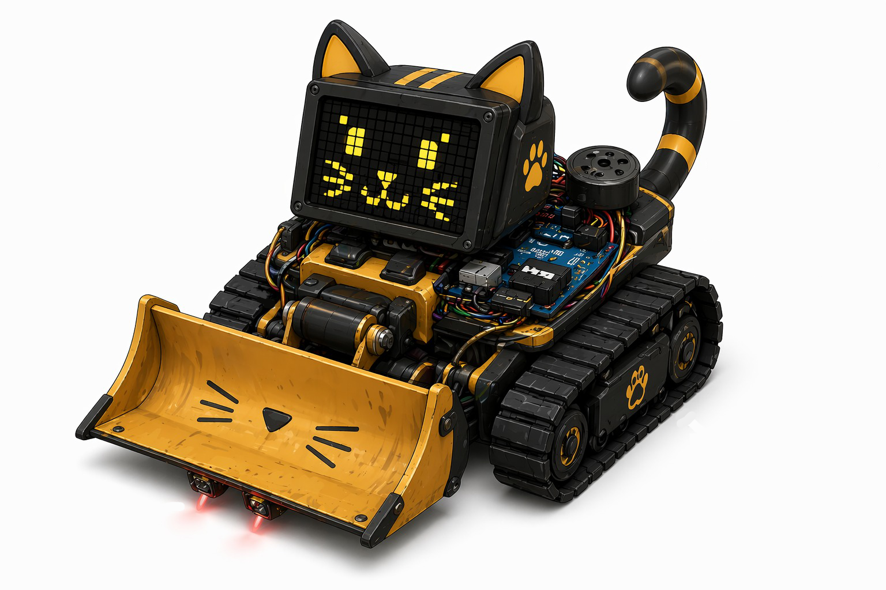

# chaos-cat
Gruppenarbeit Interaktive Systeme - Ein Roboter Haustier das dich durch Chaos aufheitert. Eine Katze die auf deinem Schreibtisch umherfährt und Aufmerksamkeit braucht um ruhig zu bleiben. Wenn es wütend wird schiebt es die Sachen umher uder schiebt diese ganz vom Tisch.
# Umsetzung
* Software
    * Status basierte Schleifen, Zeitabfolgen
    * Zufällige Fahrbewegungen
* Technik
    * Geschwindigkeit der Motoren
    * Empfindlichhkeit der Sensoren
* 3D gedruckte Teile
    * 3D-Modellierung
    * Drucken und Anpassungen
# IO
Input
* Ultraschall Sensor
* Kapazitiver Sensor

Output
* LED
* Fahrgestell
* Buzzer
* Servo (für Schwanz)

# Gefühlslagen
## Glücklich
Wenn die Chaos-Cat genug Aufmerksamkeit bekommt durch regelmäßiges Streicheln (kapazitiver Sonsor)
* Fährt ruhig herum (Schiebt Gegenstände herum)
* Grüne LED
* Buzzer wie schnurren
* Servomotor beweg sich langsam

## Wütend
Nach einer gewissen Zeit ohne Beachtung (kein Input)
* Schnelles hektisches Fahren (Schmeißt Gegenstände vom Tisch)
* Rote schnell blinkende LED
* Buzzer hektisch hoher Ton
* Servomotor beweg sich hektisch

## Ängstlich
An einer Tischkante wo sich die Chaos-Cat nicht selbst retten kann (Ultraschall Sensor)
* Led Blinkt impulsiv
* Buzzer piebt hektisch
* Bleibt stehen
* Servomotor bleibt stehen

# Visualisierung der Idee

